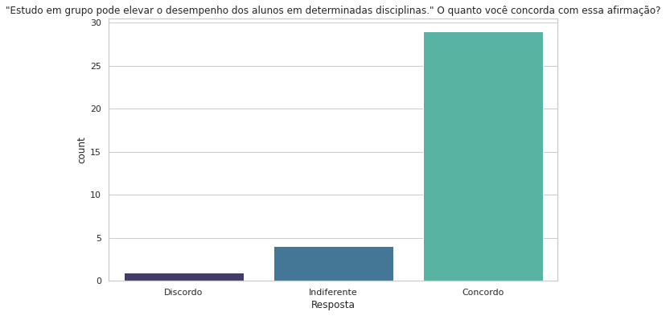
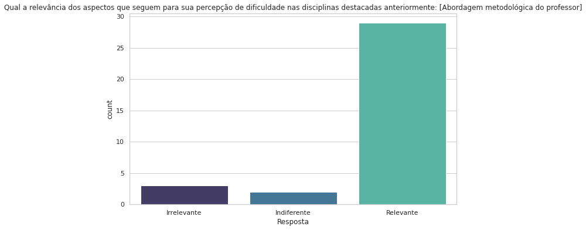
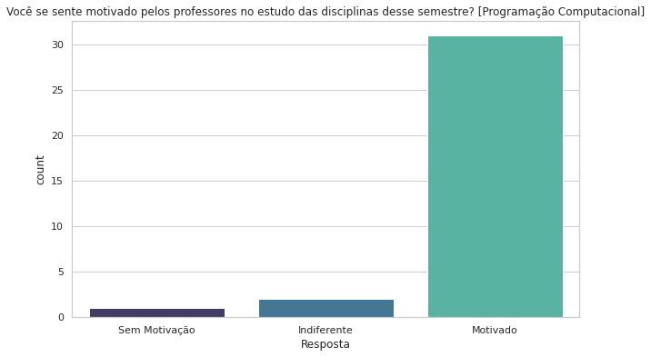
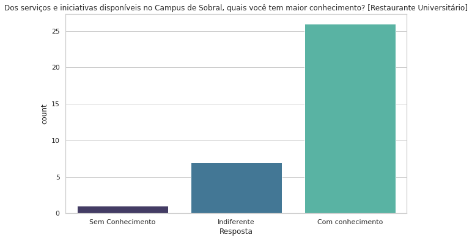
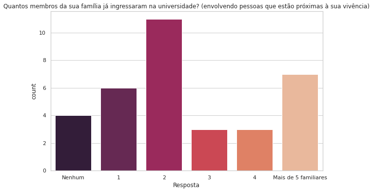

# Pesquisa para análise da evasão dos ingressantes do curso de Engenharia da Computação da UFC

### Análise do sentimento de evasão dos alunos ativos no curso de Engenharia Da Computação na Universidade Federal do Ceará. A pesquisa tem como objetivo fazer uma analise dos motivos que levam a desistência dos alunos ingressantes do curso.

### O questionário contém 69 perguntas e obteve 34 respostas de alunos do primeiro semestre da engenharia da computação.

### A pesquisa tem padrões de perguntas e respostas os tipos de perguntas são:

  - Perguntas com respostas binárias: Sim ou não, em alguns casos contém a alternativa "Não se aplica".
  
  
  
  - Perguntas relacionadas ao nivel de concordancia, são divididas em 3 classes: "Discordo", "Indiferente", "Concordo"
  
  
  
  - Perguntas Relacionadas ao Tipo de Relevancia, podem ser divididas em 3 classes, sendo elas: "Irrelevante", "Indiferente, "Relevante"
  
  
  
  - Perguntas Relacionadas a Motivação, podem ser divididas em 3 classes, sendo elas: "Sem Motivação", "Indiferente, "Motivado"
  
  
  
  - Perguntas Relacionadas ao Conhecimento com as Iniciativas disponiveis no Campus de Sobral podem ser divididas em três classes, sendo elas: "Sem Conhecimento", "Indiferente, "Com conhecimento"
  
  
  
  - Perguntas que não se encaixam nos padrões das perguntas anteriores
  
  

